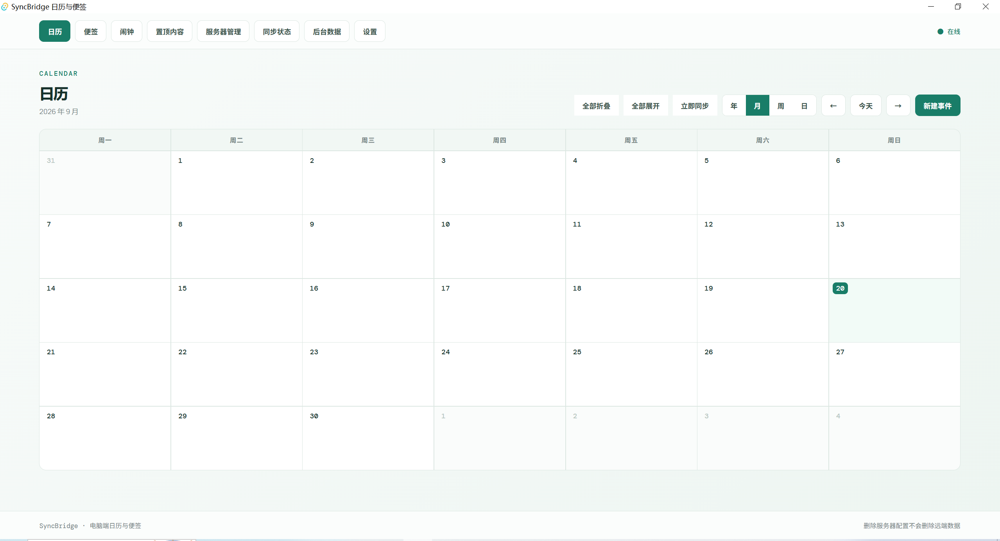
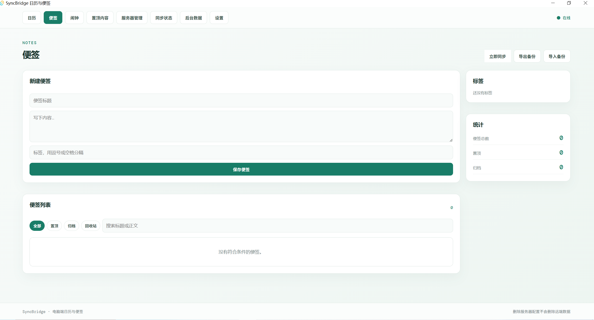
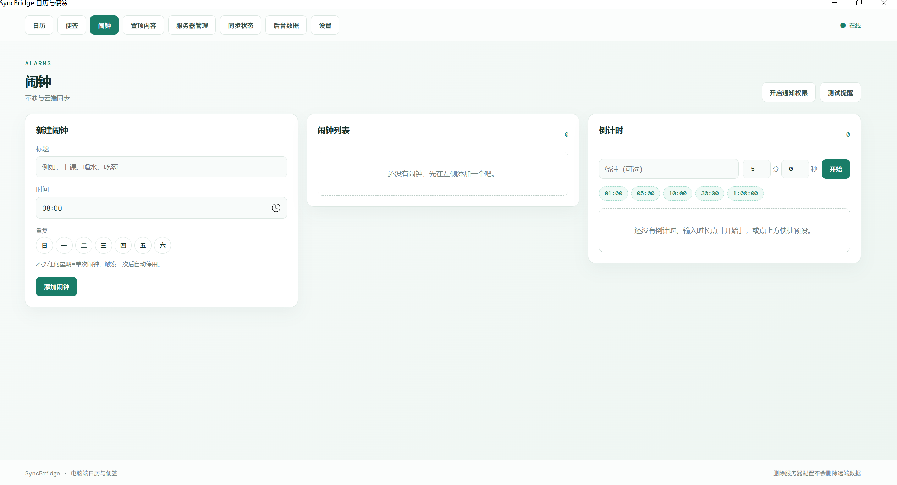
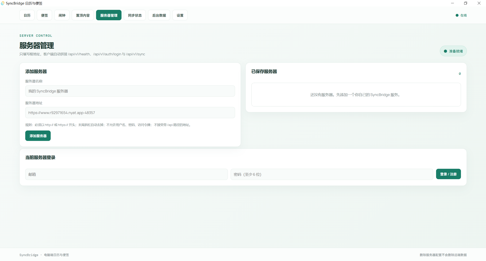
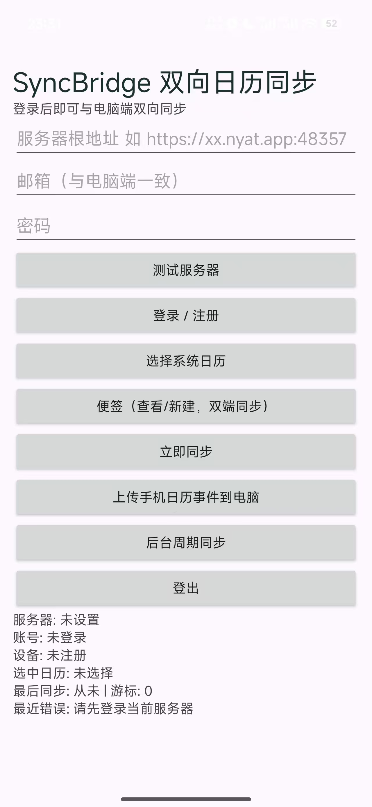

# SyncBridge — 双向日历与便签同步

SyncBridge 是一套**自托管**的跨设备同步工具：**Windows 桌面客户端 + Android 手机端 + FastAPI 后端**，用于在电脑与手机之间双向同步日历与便签。

- **零成本部署**：后端跑在一台常开的电脑上，借助 Sakura FRP 内网穿透获得公网访问能力，**无需租用云服务器**；
- **零数据库配置**：使用 Python 内置的 SQLite 单文件数据库，**无需下载安装 MySQL**，开箱即用；
- **只填根地址**：客户端只需要一个服务器根地址，自动拼接健康检查、登录与同步接口；
- **增量同步**：游标式变更日志，处理成功后才推进游标，不丢数据、不重复拉取。

---

## 界面展示

界面采用浅色单页设计，墨绿主色，八个功能页签（日历 / 便签 / 闹钟 / 置顶内容 / 服务器管理 / 同步状态 / 后台数据 / 设置）平铺在顶部，**无二级菜单**，右上角常驻连接状态灯。所有操作一屏可见、一目了然。

**日历**：月视图网格，右上角集中了视图切换（年/月/周/日）、同步与新建入口，一键"今天"回位。



**便签**：左侧新建与列表，右侧标签与统计；支持置顶、归档、回收站找回与导入导出备份。



**闹钟**：新建闹钟、闹钟列表与倒计时三栏布局，本地功能独立于同步体系。



**服务器管理**：添加服务器（只填根地址）与账号登录在同一页完成，准备状态实时显示。



**Android 手机端**：单列极简布局，按钮从上到下按使用顺序排列，登录后即可与电脑端双向同步。



---

## 功能特性

| 模块 | 说明 |
| --- | --- |
| 日历 | 年 / 月 / 周 / 日四种视图，新建、置顶事件，一键"今天"回位 |
| 便签 | 置顶 / 归档 / 回收站，标签分类与全文搜索，支持导入导出备份 |
| 闹钟 | 本地闹钟与倒计时，同日多提醒按顺序触发（不参与云同步） |
| 服务器管理 | 多服务器配置保存，一键测试连通性 |
| 同步状态 | 游标、最近同步时间、最近错误一目了然 |
| 手机端日历桥接 | 通过 Android 系统日历接口双向同步，不读取厂商私有数据库 |

## 系统架构

```
Windows 客户端 (exe) ─┐
                      ├─→ Sakura FRP 隧道 ─→ FastAPI 后端 (:8123) ─→ SQLite 单文件数据库
Android 客户端 (apk) ─┘        (公网域名)         局域网内可直连本机 IP
```

- **后端**：Python 3.10+ / FastAPI / Uvicorn，默认端口 **8123**；
- **数据库**：SQLite 单文件（`数据库/syncbridge.db`），随 Python 内置；
- **客户端**：Windows 端为 Tauri 应用（需 WebView2 Runtime）；Android 端直接安装 APK。

---

## 使用方法

> 总览：**① 准备运行环境 → ② 启动 FastAPI 后端 → ③ Sakura FRP 内网穿透 → ④ 安装 Windows 客户端 → ⑤ 安装 Android 手机端 → ⑥ 开始同步**

### 第 1 步：准备运行环境（无需 MySQL）

> ⚠️ 常见误解澄清：**本软件不需要下载安装 MySQL。** 数据库使用 Python 自带的 SQLite（单文件，零配置），装好 Python 就等于装好了数据库。如果你机器上已有 MySQL 也无妨，软件不会用到它。

后端机器只需要安装 **Python 3.10 或更高版本**，安装时务必勾选 **"Add Python to PATH"**。

下载地址：<https://www.python.org/downloads/>（国内网络建议使用华为镜像：`https://mirrors.huaweicloud.com/python/`）。

### 第 2 步：启动 FastAPI 后端

进入 `后端` 目录，双击运行：

```
启动后台服务.bat
```

脚本会自动完成虚拟环境创建与依赖安装（首次约 1-2 分钟），然后监听 **8123 端口**。也可以手动执行：

```powershell
cd 后端
python -m venv .venv
.\.venv\Scripts\python.exe -m pip install -r requirements.txt
$env:SyncBridge_DB_PATH = "数据库绝对路径\syncbridge.db"
$env:PYTHONPATH = "后端目录绝对路径"
.\.venv\Scripts\python.exe -m uvicorn app.main:app --host 0.0.0.0 --port 8123
```

启动后在本机浏览器验证健康检查：

```
http://127.0.0.1:8123/api/v1/health
```

返回 `{"service":"syncbridge","status":"ok"}` 即启动成功。接口文档见 `http://127.0.0.1:8123/docs`。

> 保持窗口开启，**关闭窗口即停止服务**。

### 第 3 步：配置 Sakura FRP 内网穿透（数据传输通道）

手机在外网无法直接访问家里/宿舍的电脑，需要用 Sakura FRP 把本机 8123 端口映射到公网：

1. 注册并登录 [Sakura FRP](https://www.natfrp.com/)，创建一条**隧道**，本地目标填写 `127.0.0.1:8123`；
2. 下载并启动 Sakura FRP 启动器，运行该隧道，获得公网地址，形如：

   ```
   https://xxxxx.nyat.app:48357
   ```

3. 用手机浏览器访问 `https://你的公网域名/api/v1/health`，能返回 `status: ok` 即穿透成功；
4. **记下这个公网根地址**，两端客户端都要填它。

> 建议：正式公网使用应启用 HTTPS（Sakura FRP 支持 HTTPS 隧道）；明文 HTTP 仅适合局域网、校园网或临时测试。

### 第 4 步：安装 Windows 客户端

`exe` 目录提供两个版本：

- `SyncBridge_0.1.0_x64-setup.exe`：**安装版**，适合长期使用；
- `SyncBridge_portable.exe`：**绿色版**，双击即用，不写入注册表。

安装/启动后按以下顺序配置：

1. 进入 **服务器管理** 页签 → **添加服务器**：只填根地址（如 `https://xxxxx.nyat.app:48357`），**不要带** `/api/v1/health` 等接口路径；
2. 在同页下方输入邮箱和密码（至少 6 位）→ 点击 **登录 / 注册**（首次输入即注册）；
3. 状态栏显示 **准备就绪** 即连接成功。

> 绿色版窗口空白时，优先安装或修复 WebView2 Runtime，或改用安装版。

### 第 5 步：安装 Android 手机端

1. 将 `apk/SyncBridge_0.2.0_20260919_2149.apk` 传到手机并安装，允许"安装未知来源应用"；
2. 打开 SyncBridge，填写与电脑端**完全相同**的服务器根地址、邮箱、密码；
3. 依次授权：读取日历、写入日历、通知；系统若提供"后台活动 / 自启动"选项建议开启；
4. 点击 **选择系统日历**，勾选要同步的日历。

### 第 6 步：开始同步

- 两端登录同一账号后，点击 **立即同步** 即可互传日历与便签；
- 手机端可用 **上传手机日历事件到电脑** 做首次导入，或开启 **后台周期同步**；
- **验证方法**：电脑端新建一个事件 → 手机端点"立即同步" → 日历中出现即成功。

> 两端必须使用：**同一个服务器根地址 + 同一个邮箱 + 同一个密码**。

---

## 常见问题

| 现象 | 处理方法 |
| --- | --- |
| 客户端一直显示离线 / 连接失败 | 依次检查：后端窗口是否开启 → 本机健康检查是否 ok → FRP 隧道是否在线 → 公网健康检查是否 ok |
| 服务器地址怎么填 | 只填根地址（协议 + 域名 + 端口），不要拼 `/api/v1/health` 等接口路径 |
| 绿色版窗口空白 | 安装或修复 WebView2 Runtime，或改用安装版 |
| 提交时返回 409 | 版本冲突：另一端已修改同一条记录，拉取最新数据后再修改提交 |
| 误删了事件 / 便签 | 软删除保留 30 天，可在回收站（便签）或恢复接口找回 |
| 自动同步不生效 | 受手机系统限制时可打开应用手动点"立即同步" |
| 备份数据 | 停止后端后复制 `数据库/syncbridge.db`；恢复前先备份当前库再替换，**不要在服务运行时覆盖数据库文件** |

---

## 目录结构

```
SyncBridge/
├─ 后端/                 FastAPI 后端（app/、tests/、Dockerfile、启动后台服务.bat）
├─ 数据库/               SQLite 数据库文件（运行后生成）
├─ exe/                  Windows 客户端（安装版 + 绿色版）
├─ apk/                  Android 客户端
├─ 测试/                 部署过程测试记录
└─ docs/screenshots/     界面截图
```

## 安全说明

- 密码使用 PBKDF2-SHA256（210,000 轮）加盐存储，服务端不保存明文；
- 访问令牌 2 小时过期，刷新令牌 30 天且**一次性轮换**，登出即吊销全部令牌；
- 账号身份一律从令牌解析，客户端传入的账号字段不被信任；
- 公网部署请务必启用 HTTPS，并保管好后端机器与 Sakura FRP 账号。

## 开发

```powershell
# 运行测试
cd 后端
.\.venv\Scripts\python.exe -m pytest tests -v

# Docker 运行（可选，默认 8000 端口）
docker build -t syncbridge-api .
docker run -p 8000:8000 -v 数据库目录:/data syncbridge-api
```

后端在 `/` 同时托管已构建的前端单文件（`desktop/dist/index.html`），缺失时退化为纯 API 服务。

---

*SyncBridge · 隐藏日历与便签 —— 删除账本配置不会删除远程数据。*
